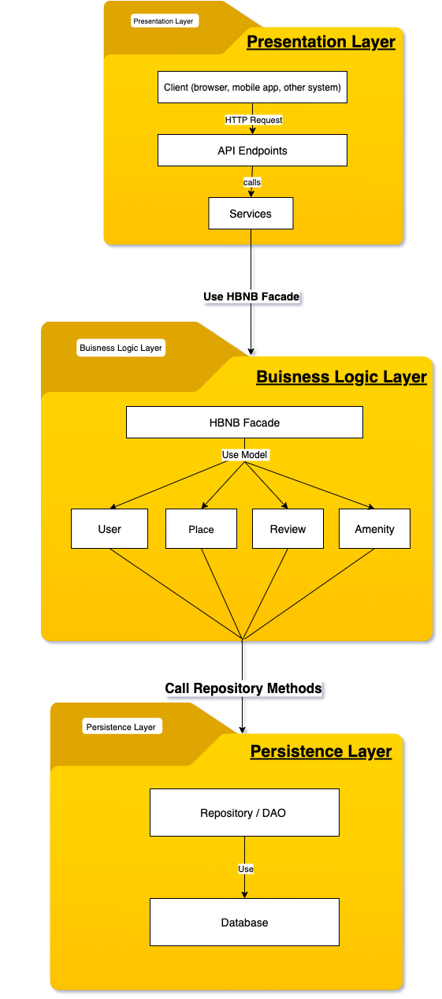
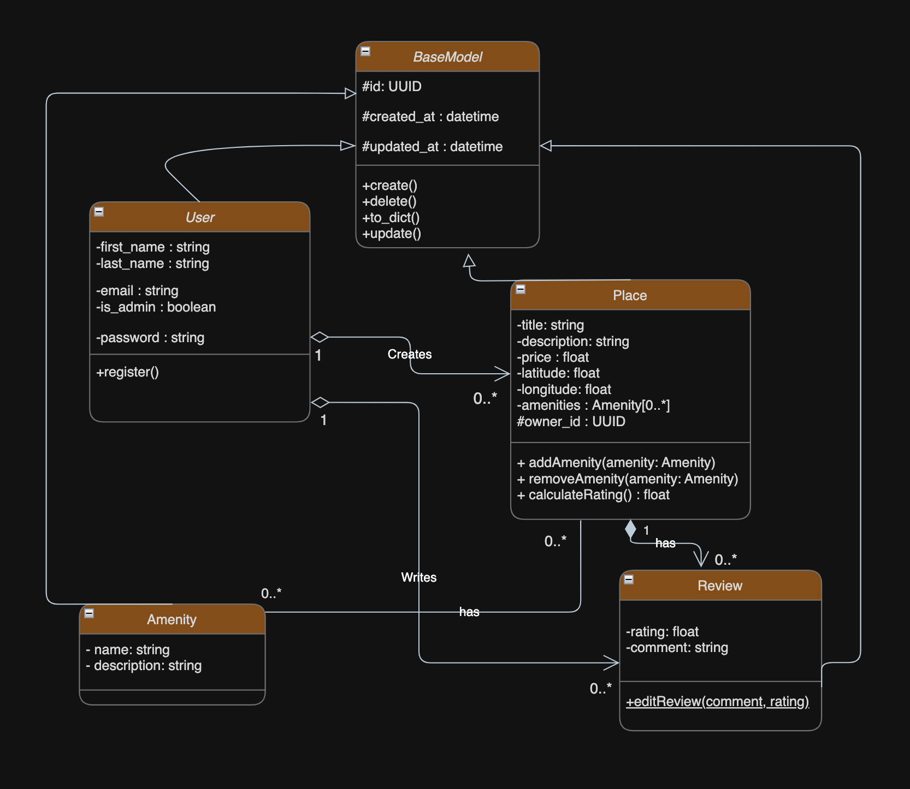

# HBnB Evolution - Technical Documentation
## Part 1: System Architecture and Design

### Project Context
HBnB Evolution is a comprehensive property rental platform inspired by modern sharing economy applications. This document serves as the foundational technical blueprint for the entire system, detailing the architectural decisions, business logic design, and interaction patterns that will guide the implementation phases.

---

## 1. High-Level System Architecture

### 1.1 Package Diagram Overview

### 1.2 Architectural Pattern Justification

**The Three-Layer Architecture** was selected based on several critical considerations:

**Separation of Concerns**: Each layer has distinct responsibilities, preventing the mixing of presentation logic with business rules or data access code. This separation ensures that changes in one layer have minimal impact on others.

**Maintainability and Scalability**: As HBnB Evolution grows, this architecture allows individual layers to scale independently. For instance, the Presentation Layer can be scaled horizontally to handle increased user traffic without affecting the Business Logic Layer.

**Team Development Efficiency**: Different team members can work on separate layers concurrently, reducing development conflicts and enabling specialized expertise in each domain.

**Technology Flexibility**: The layered approach permits technology stack evolution. Should we decide to replace the web frontend with a mobile-native interface or switch database technologies, the changes remain isolated to their respective layers.

### 1.3 Layer Responsibilities and Interactions

**Presentation Layer**
- **Primary Role**: Serve as the system's external interface, handling all client interactions
- **Key Components**: RESTful API endpoints, request validation, response formatting, and session management
- **Design Rationale**: By concentrating HTTP-specific logic in this layer, we ensure that business rules remain transport-agnostic, potentially supporting other protocols in the future

**Business Logic Layer** 
- **Core Function**: Implement the essential business rules, validations, and entity relationships that define HBnB's operational logic
- **Critical Elements**: Domain models (User, Place, Review, Amenity), business validations, and the Facade pattern implementation
- **Architectural Significance**: This layer contains the most valuable intellectual property of the application—the business rules that differentiate HBnB in the market

**Persistence Layer**
- **Data Management**: Provide abstracted data access mechanisms that insulate the business logic from storage concerns
- **Implementation Approach**: Repository pattern with Data Access Objects (DAOs) to encapsulate database operations
- **Strategic Advantage**: This abstraction enables potential future migration between different storage technologies without impacting business logic

### 1.4 Facade Pattern Implementation

The **HBNB Facade** serves as a unified entry point to the Business Logic Layer, providing several key benefits:

**Simplified Client Interaction**: External components interact with a single, well-defined interface rather than multiple complex subsystems

**Reduced Coupling**: The Presentation Layer depends only on the Facade interface, not on the internal complexity of the business logic

**Centralized Cross-Cutting Concerns**: The Facade can implement consistent logging, security checks, and transaction management across all business operations

---

## 2. Business Logic Layer Design

### 2.1 Complete Class Diagram

### 2.2 Core Entity Analysis and Design Rationale

**BaseModel Abstract Class**

**Design Philosophy**: DRY (Don't Repeat Yourself) Principle

- **Universal Identifier**: UUID implementation ensures global uniqueness across distributed systems
- **Audit Trail**: created_at and updated_at timestamps provide essential business intelligence  
- **Lifecycle Management**: Centralized create/update/delete operations enforce consistent behavior
- **Serialization Support**: to_dict() method enables clean data transformation for API responses

**Business Justification**: This abstraction eliminates redundant code across entities and ensures consistent implementation of cross-cutting concerns that are fundamental to enterprise applications.

**User Entity**

**Critical Business Attributes**:
- **Identity Management**: first_name and last_name support personalization features
- **Authentication**: email and password enable secure access with industry-standard practices
- **Authorization Control**: is_admin boolean enables differentiated permission structures

**Design Decisions**:
- The separation of regular users and administrators directly supports the business requirement for content moderation and system management capabilities
- Password storage considerations (though hashing implementation details reside in security layer)

**Business Context**: User management forms the foundation of trust and accountability in sharing economy platforms.

**Place Entity**

**Property Representation**:
- **Marketing Elements**: title and description drive user engagement and discovery
- **Financial Aspect**: price enables the core rental transaction functionality
- **Location Intelligence**: latitude and longitude support geographic searches and mapping integrations
- **Ownership Tracking**: owner_id establishes critical accountability and permission structures

**Advanced Business Logic**:
- **amenities**: List<Amenity> implements the many-to-many relationship through collection management
- **calculateRating()**: Method encapsulates the business rule for aggregating review scores

**Strategic Importance**: The Place entity represents the primary inventory of the platform and directly drives revenue generation.

**Review Entity**

**Trust and Reputation System**:
- **rating**: float enables nuanced evaluation (supports decimal ratings like 4.5 stars)
- **comment**: string captures qualitative user experiences

**Relationship Integrity**:
- The composition relationship with Place ensures data consistency—reviews cannot exist independently of the places they evaluate
- Association with User establishes reviewer accountability

**Business Value**: Reviews build the trust framework essential for transaction completion in peer-to-peer marketplaces.

**Amenity Entity**

**Feature Catalog Management**:
- **name** and **description** create a searchable, maintainable catalog of property features
- Many-to-many relationship with Place enables flexible feature assignment without data duplication

**Design Advantage**: Centralized amenity management allows for consistent naming, future categorization, and cross-property feature analysis.

### 2.3 Relationship Design Analysis

**User → Place Association (1..* to 0..*)**
- **Cardinality Justification**: A user may own zero or multiple properties, while each property must have exactly one owner
- **Business Logic**: This relationship enables the core rental marketplace functionality while maintaining clear ownership accountability

**User → Review Association (1 to 0..*)**
- **Design Rationale**: Users may write multiple reviews, establishing their reputation within the community
- **Data Integrity**: The relationship preserves review authorship even if user details change

**Place → Review Composition (1 to 0..*)**
- **Architectural Decision**: Composition rather than aggregation because reviews have no meaningful existence independent of their associated place
- **Business Implication**: Place deletion cascades to reviews, maintaining database consistency and preventing orphaned content

**Place ↔ Amenity Many-to-Many Association (0..* to 0..*)**
- **Implementation Approach**: Direct collection management within Place entity with addAmenity() and removeAmenity() methods
- **Scalability Consideration**: For high-volume scenarios, this could evolve into an explicit association class with additional metadata

### 2.4 Method Design and Business Logic Encapsulation

**BaseModel Method Strategy**
- **create()**: Centralizes object initialization with proper UUID generation and audit timestamp setting
- **update()**: Ensures consistent updated_at timestamp management across all entities
- **to_dict()**: Provides uniform serialization for API responses and caching layers

**Place Business Methods**
- **addAmenity()/removeAmenity()**: Encapsulate the complexity of managing many-to-many relationships
- **calculateRating()**: Implements the business rule for aggregating and weighting review scores

**Review Management Methods**
- **editReview()**: Supports user modifications while potentially maintaining edit history for integrity

---

## 3. API Interaction Flow Design

### 3.1 Sequence Diagram Strategy

The four selected API calls represent the core user journey through the HBnB platform:

**User Registration Sequence**
- **Business Significance**: Onboarding new users to grow the platform ecosystem
- **Technical Complexity**: Password hashing, email validation, and profile initialization
- **Data Flow**: Presentation → Facade → User Model → Repository → Database

**Place Creation Workflow**  
- **Business Criticality**: Expanding property inventory for rental marketplace
- **Validation Requirements**: Location validation, price sanity checks, owner verification
- **Integration Points**: Potential geocoding services, image storage initialization

**Review Submission Process**
- **Trust Building**: Core mechanism for establishing platform credibility
- **Business Rules**: Rating validation, single-review-per-stay enforcement, spam prevention
- **Data Relationships**: Complex coordination between User, Place, and Review entities

**Place Search and Retrieval**
- **Performance Considerations**: Pagination, filtering, sorting, and geographical queries
- **User Experience**: Response time optimization for browse-heavy usage patterns
- **Caching Strategy**: Potential implementation of search result caching

### 3.2 Cross-Layer Communication Patterns

The sequence diagrams will illustrate several key architectural patterns:

**Facade Coordination**: How the HBNB Facade orchestrates complex operations across multiple business entities

**Error Handling**: Consistent error propagation from database constraints through to user-friendly API responses

**Transaction Management**: Data consistency approaches for multi-step operations

**Validation Layering**: How input validation is distributed across presentation, business, and persistence layers

---

## 4. Implementation Readiness Assessment

### 4.1 Architecture Validation

**Strengths of the Current Design**
- Clear separation of concerns supporting maintainability
- Comprehensive entity relationships covering all business requirements
- Flexible many-to-many implementation allowing future enhancement
- Audit trail support for business intelligence and compliance

**Considerations for Future Evolution**
- Pagination strategy for large result sets in Place listings
- Caching layer positioning for performance optimization
- Full-text search integration for place discovery
- Notification system for user engagements

### 4.2 Next Phase Implementation Priorities

**Phase 2 Priorities**
1. Database schema design reflecting the business entities and relationships
2. Repository pattern implementation with concrete data access logic
3. HBNB Facade development with transaction management
4. Basic API endpoint implementation for core operations

**Phase 3 Considerations**
1. Authentication and authorization integration
2. Advanced search and filtering capabilities
3. Image storage and management for property listings
4. Review moderation and spam detection systems

---

## 5. Conclusion

This technical documentation establishes a robust foundation for HBnB Evolution development. The three-layer architecture provides the structural integrity needed for scalable growth, while the detailed business logic design captures the essential domain complexity of a modern rental platform.

The class diagram represents a careful balance between normalization for data integrity and pragmatic design for development efficiency. The relationship structures support both current business requirements and anticipated future enhancements.

As the project progresses into implementation phases, this documentation will serve as the authoritative reference for architectural decisions, ensuring consistency and alignment with business objectives across all development activities.

---

*Technical Documentation - HBnB Evolution*  
*Architecture Review Completed: [Date]*  
*Next Review Scheduled: Phase 2 Implementation Kickoff*