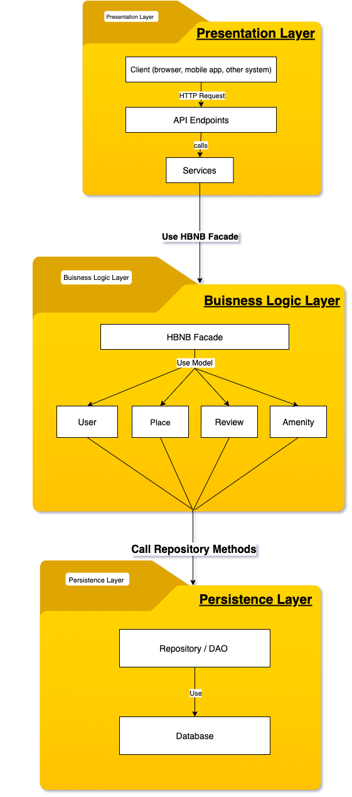
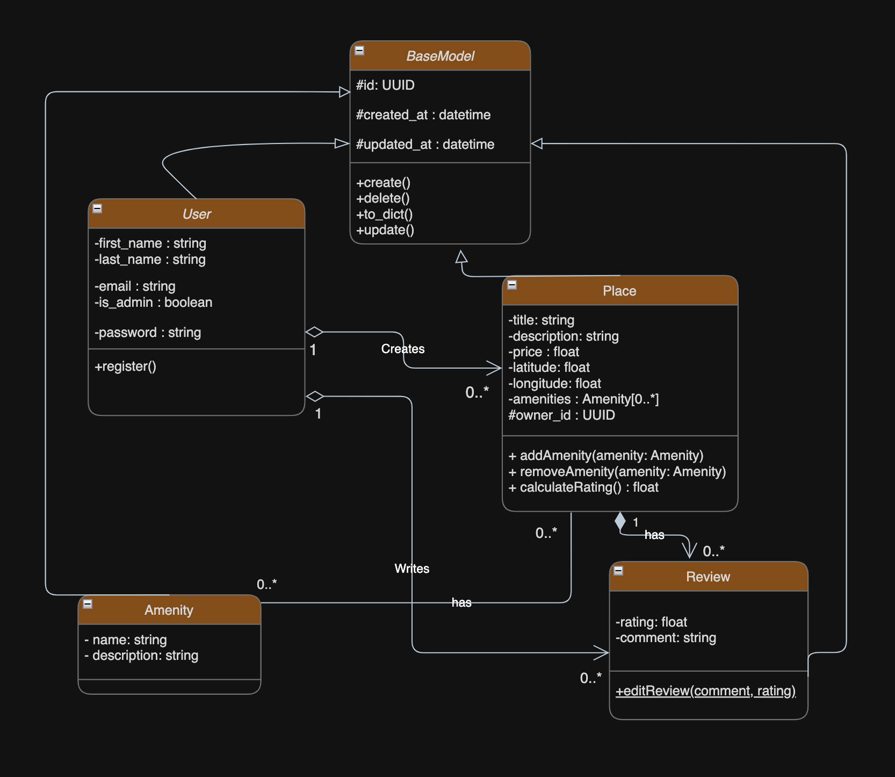
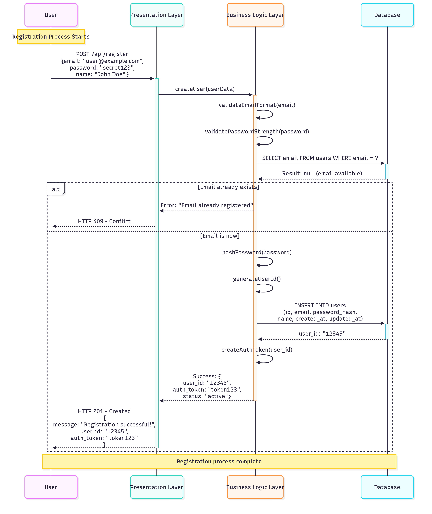
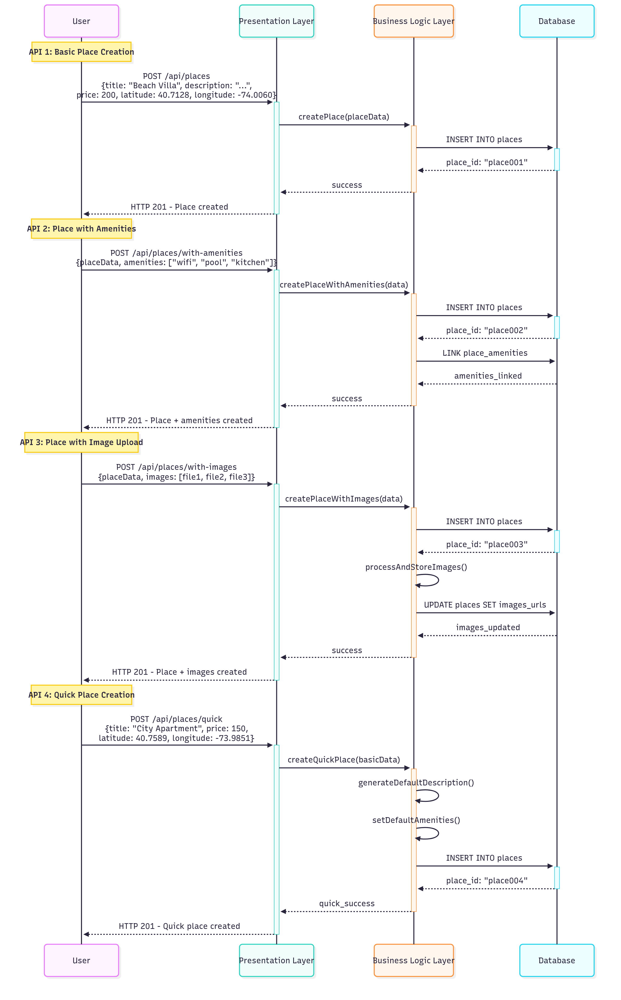
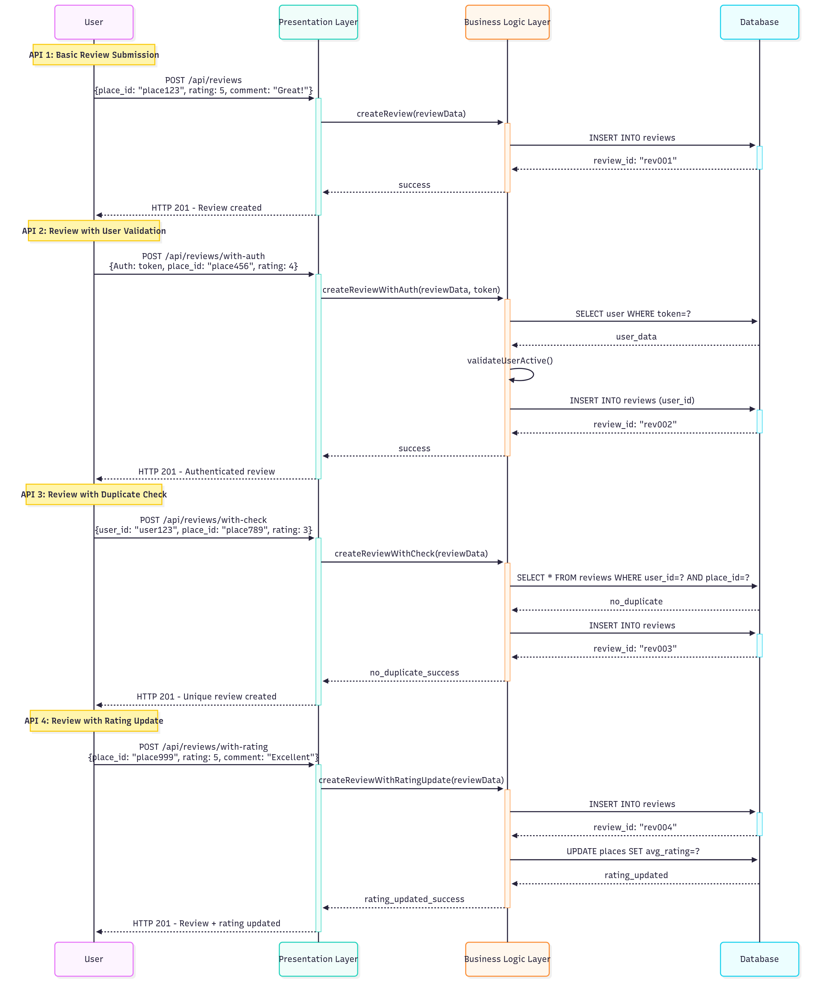
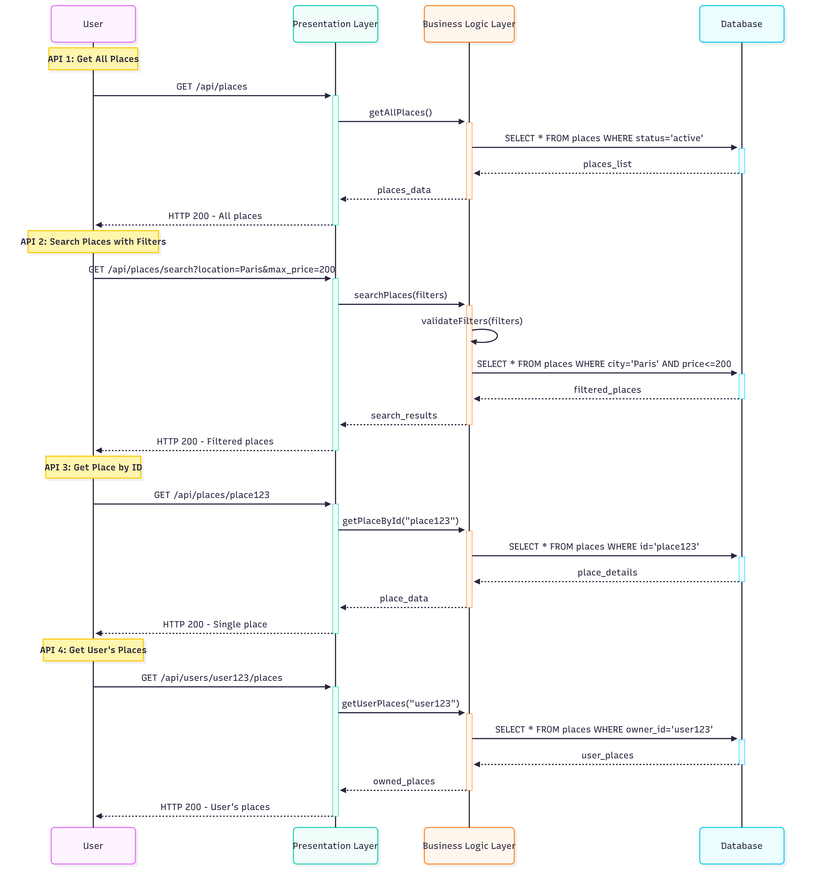

# HBnB Evolution - Technical Documentation

This document contains the complete technical documentation for HBnB Evolution project — Part 1 of Holberton School curriculum. It provides all required UML diagrams and architectural specifications for the application's foundation.

## Summary
- [Introduction](#introduction)
- [High-Level Architecture](#high-level-architecture)
- [Business Logic Layer](#business-logic-layer)
- [API Interaction Flow](#api-interaction-flow)
- [Project Structure](#project-structure)

## Introduction
This document serves as the foundational technical reference for HBnB Evolution system architecture and design, created as part of Part 1 deliverables. It establishes the complete blueprint for the application development.

### Documentation Scope
- Comprehensive architecture design using UML standards
- Detailed business logic layer specification
- API interaction patterns and data flow
- Implementation guidelines for development phases

### Main Goals
- Provide complete visual representation of system architecture using industry-standard UML
- Document design decisions and business logic implementation with clear rationale
- Establish reliable reference documentation for development and maintenance teams
- Ensure consistency and quality across all implementation phases

## High-Level Architecture

### Package Diagram

### Architecture Overview
The system implements a robust three-layer architecture that separates concerns and promotes maintainability:

**Presentation Layer**
- Manages all client interactions through RESTful API endpoints
- Handles HTTP request validation, authentication, and response formatting
- Provides clean service interfaces for web and mobile clients

**Business Logic Layer**
- Contains the core business rules, validations, and entity models
- Implements HBNB Facade pattern to simplify interactions between layers
- Encapsulates all domain-specific logic and operational workflows

**Persistence Layer**
- Handles all data storage and retrieval operations through Repository pattern
- Abstracts database operations via Data Access Objects (DAOs)
- Manages database connections, transactions, and data mapping

### Design Rationale
The layered architecture was chosen to ensure:
- **Maintainability**: Independent evolution and updates to each layer
- **Testability**: Isolated unit and integration testing capabilities
- **Scalability**: Horizontal scaling potential for high-traffic components
- **Flexibility**: Future technology changes without system-wide impact

## Business Logic Layer

### Class Diagram

### Core Entity Specification

**BaseModel**
- Foundation class providing common functionality across all business entities
- Attributes: `id` (UUID), `created_at`, `updated_at`
- Methods: `create()`, `update()`, `delete()`, `to_dict()`
- Design Purpose: Implements DRY principle and provides consistent audit trail

**User**
- Represents system users with complete authentication and authorization
- Attributes: `first_name`, `last_name`, `email`, `password`, `is_admin`
- Business Role: Manages user profiles, permissions, and account lifecycle

**Place**
- Manages rental property listings with comprehensive location and pricing data
- Attributes: `title`, `description`, `price`, `latitude`, `longitude`, `owner_id`
- Methods: `addAmenity()`, `removeAmenity()`, `calculateRating()`
- Business Function: Property management, availability, and feature handling

**Review**
- Handles user feedback, ratings, and review system
- Attributes: `rating` (float), `comment`
- Business Logic: Rating validation, review moderation, user experience tracking

**Amenity**
- Manages property features and equipment catalog system
- Attributes: `name`, `description`
- Business Purpose: Standardized feature management and categorization

### Entity Relationships

**User → Place** (Ownership: 1 → 0..*)
- A user can own zero or multiple rental properties
- Establishes clear ownership and permission boundaries

**Place → Review** (Composition: 1 → 0..*)
- Reviews are intrinsically tied to specific places
- Ensures data consistency and prevents orphaned reviews

**User → Review** (Association: 1 → 0..*)
- Users can author multiple reviews across different properties
- Maintains user reputation and review history

**Place ↔ Amenity** (Many-to-Many: 0..* ↔ 0..*)
- Flexible association between properties and their features
- Enables rich search and filtering capabilities

## API Interaction Flow

### Sequence Diagrams Specification
The application implements four core API workflows documented through detailed sequence diagrams:

#### User Registration

- Complete user onboarding process from initial request to account creation
- Includes email validation, password security, and profile initialization
- Handles both success scenarios and error conditions gracefully

#### Place Creation

- End-to-end property listing creation workflow
- Manages owner verification, location data validation, and pricing setup
- Supports amenity associations and media upload preparation

#### Review Submission

- Comprehensive review creation and rating submission process
- Validates user-place relationships and rating boundaries
- Ensures review integrity and spam prevention

#### Fetching Places List

- Advanced search and retrieval operations with filtering
- Implements pagination, sorting, and related data loading
- Optimizes performance for large result sets

### Interaction Patterns
All API calls follow consistent interaction patterns:
- Request validation at presentation layer
- Business logic execution through facade
- Data persistence via repository abstraction
- Response formatting and error handling

## Project Structure

### Implementation Approach
The project follows an iterative development methodology with clear phase separation:

**Phase 1 - Technical Design** (Current)
- Complete UML diagram specification
- Architecture validation and refinement
- API contract definition

**Phase 2 - Core Development**
- Database schema implementation based on business entities
- Repository pattern and data access layer
- Business logic integration and testing

**Phase 3 - API Implementation**
- RESTful endpoint development
- Authentication and authorization system
- Comprehensive testing suite

### Development Standards
- **Code Organization**: Clear separation following architecture layers
- **Documentation**: Inline code documentation with API specifications
- **Testing**: Multi-layer testing strategy (unit, integration, API)
- **Version Control**: Feature branch workflow with code review

### Quality Assurance
- Architecture review and design validation
- Code quality metrics and static analysis
- Performance benchmarking and optimization
- Security assessment and vulnerability testing

## Author
**Sedra Ramarosaona** - [GitHub Profile Link](https://github.com/SedraR78)
**Frances Mascarenhas Palmer** - [GitHub Profile Link](https://github.com/FrancesMP)
**Bryan Kotro Mbomba** - 

---

*HBnB Evolution - Part 1 Technical Documentation*  
*Document Version: 1.0 | Complete UML Specification*